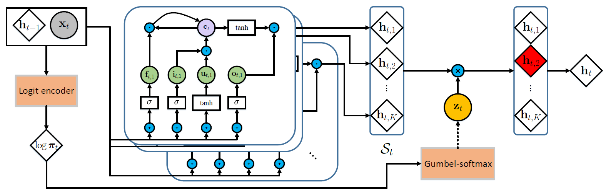
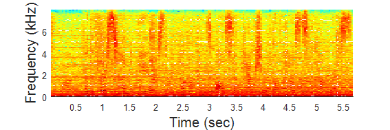
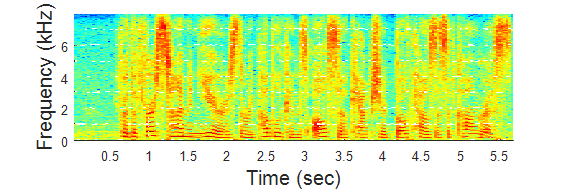
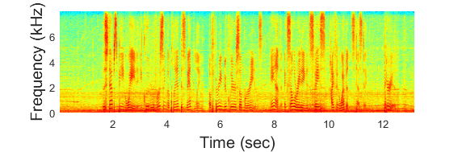
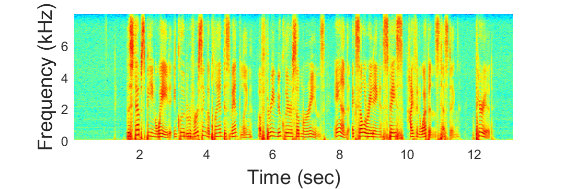
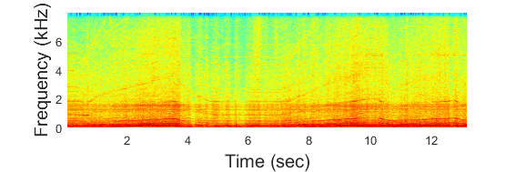
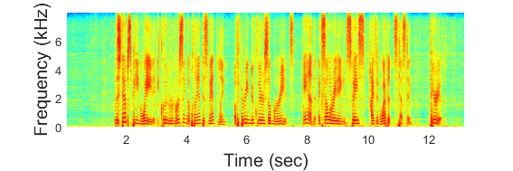

# Markov Recurrent Neural Network for speech enhancement
In this project, we implement Markov Recurrent Neural Network (MRNN) for speech enhancement.

Markov recurrent neural network (MRNN) explore the stochastic transitions in recurrent neural networks by incorporating the Markov property with discrete random variables. This model was proposed to deal with highly structured sequential data with complicated latent information. The discrete samples are drawn from the parameterized categorical distribution at each time step, and latent information is encoded by different state encoders depends on which state is selected.

## Setting
- Hardware:
	- CPU: Intel Core i7-4930K @3.40 GHz
	- RAM: 64 GB DDR3-1600
	- GPU: NVIDIA Tesla K20c 6 GB RAM
- Tensorflow 0.12
- Dataset
	- Wall Street Journal Corpus
	- Noises are collected from [freeSFX](http://www.freesfx.co.uk/soundeffects/) and [AudioMicro](http://www.audiomicro.com/free-sound-effects)

## Result
- An example of original data signal

||
|:--------------------------------------------:|
|Mixed signal|

||
|:--------------------------------------------:|
|Clean signal|

- An example of testing outputs

||
|:--------------------------------------------:|
|Mixed signal|

||
|:--------------------------------------------:|
|Clean signal|

||
|:--------------------------------------------:|
|noise signal|

||
|:--------------------------------------------:|
|output signal demixed by MRNN|

|<embed src="Others/Original_clean.wav">|
